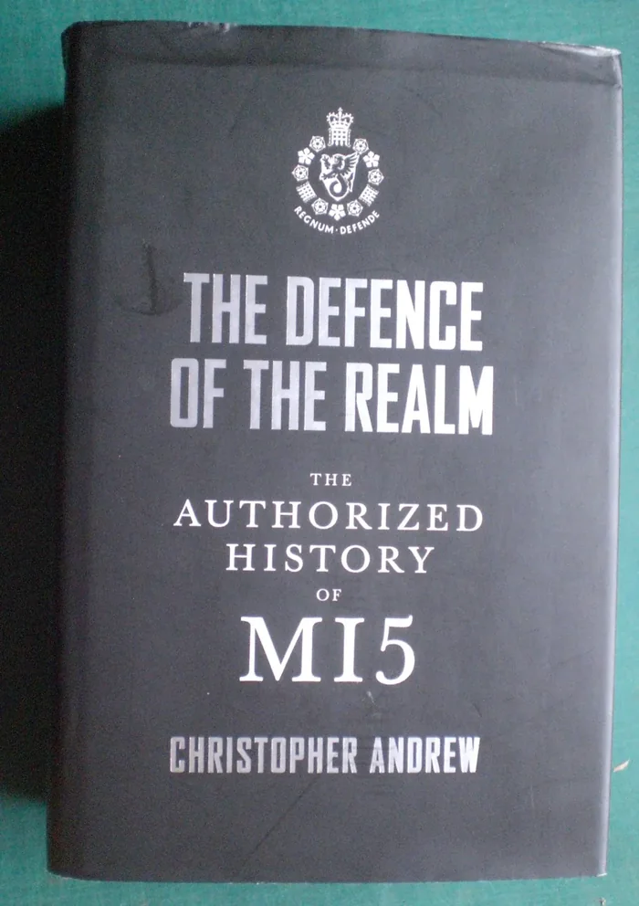
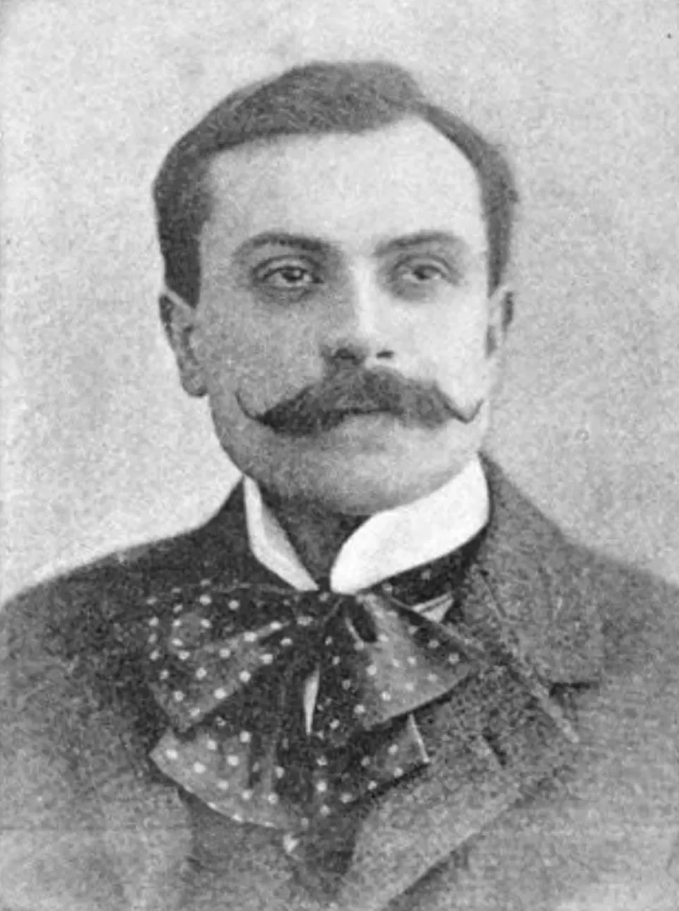
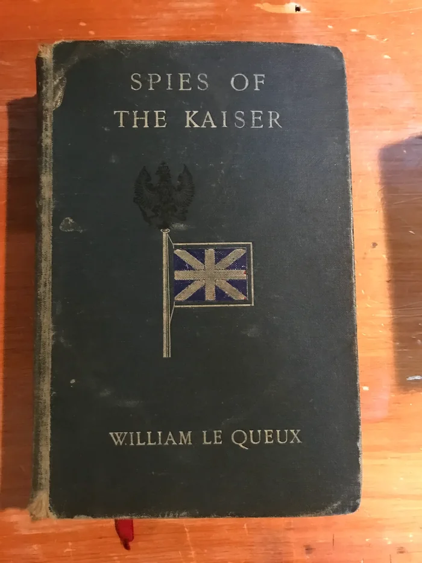

# No real adults

**Date:** 2026-09-18  
**Author:** Kamil Kazani  
**Source:** https://kamilkazani.substack.com/p/no-real-adults  
**Copied to Keg:** 2026-09-18 

---

One point you need to keep in mind that there are no real adults in the world

That is in fact the weakest spot of many (or most) conspiracy theories. They tend to presume existence of a situation room holding the dark, shady secrets hidden from the unsuspecting crowd AND composed of the real adults as opposed to naive men-children walking the streets of our cities.

Now that is wrong, of course. Not because such rooms do not exist (they do), but because they are also filled by the men-children. Simple. Naive. Vainglorious. Absolutely pathetic in all sorts of ways. Because this is the only real type of the humans walking upon earth. Whereas existence of the ‘real adults’ is pure fiction, much like that of the Olympic Gods.

Some weeks ago, I have been talking with a friend. I told him how one public figure has - on record - disclosed an *incredibly* sensitive & consequential piece of information. Like, it was mindblowing to know that this particular bit of information does even exist, and double mindblowing that he leaks it so easily, *purely to show off*.

He leaks top classified information, purely to demonstrate his knowledge & importance.

My friend was sceptical. No, he said, I don’t believe someone who has access to this kind of secrets, will be as pathetic as that. That someone to a secret situation room, figuratively and, perhaps, literally speaking, will just leak it all into media for his 10 seconds of glory.

Well, I said. I disagree. Considering what we already know about the behaviour of well-informed people, historically speaking, that is exactly the kind of behaviour you could expect. For example:

I have been recently reading *The Defence of the Realm*. Somewhere around the MI5 anniversary, they commissioned a historian to dig into their archives, and produce an official account of their history. So, basically, it is a history of British counterintelligence, verified and vouched by themselves.

One story that particularly grasped my attention, was the story of William Le Queux

He was a highly commercially successful author of the absolutely absurd, pathetic spy novels in the early 20th c Britain. In the magic world of his novels, England was swarmed by the foreign spies: French, Russian, but - most of all - German. All of whom were single-handedly outfoxed and defeated by the heroic British agent Duuckworth Drew who was - as an individual - ‘one of the most powerful and important contributers of England’s supremacy’. A sort of James Bond, except of the cosmic scale.

Who was this mysterious Duuckworth Drew, who single-handedly carried the security of British Empire on his shoulders, protecting the merry England from the encroachment of continental powers? Well, it was a thinly veiled alter ego of Queux himself. Considering that Queux must be read as ‘Kew’, the hint could not be made more clear.

I have not actually read any of Queux works myself. But based on the abundant quotations in the MI5 history, they seem to be almost surrealistically absurd. For example, in his Spies of the Kaiser (1909), a couple of British agents have successfully disclosed the entire system of German espionage in England. Naturally, the Germans would be plotting vengeance.

>In December 1908 they are presented with Christmas crackers by a group of apparently good-natured Germans, but are alerted just in time by a detective-inspector to the Germans’ real intentions:
>
>*“They intended to wreak upon both of you a terrible vengeance for your recent exposures of the German system of espionage in England and your constant prosecution of these spies.’*
>
>*‘Vengeance?’ [Jacox] gasped. ‘What vengeance?’*
>
>*‘Well,’ replied the detective-inspector, ‘both these [crackers] contain powerful bombs, and had you pulled either of them you’d both have been blown to atoms. That was their dastardly intention.”*[^1]

That sounds ridiculous enough to me, and it certainly sounded ridiculous to many, and many, back in time. Queux, despite his broad popularity, was mocked and ridiculed in press. And he did not want to remain silent:

“When the Manchester Guardian accused him of propagating the ‘German spy myth’, Le Queux replied indignantly on the letters page on 4 January 1910:

“The authorities in London must have been considerably amused by your assurances that German spies do not exist among us, for it may be news to you to know that so intolerable and marked has the presence of [these] gentry become that a **special Government Department has recently been formed** for the purpose of watching their movements.”[^2]

Stop. Full stop.

What he is even talking about?

*‘A special government department has recently been formed for the purpose of watching their [= German] movements’*

This sounds oddly specific. That kind of detail would be difficult to just make up.

Because it was not

What he is referring to, is the creation of Secret Service Bureau, in October 1909. A new government agency aimed to check the German espionage in England. That was the top classified information, that very few knew about, even in the British government. Let me quote the authorised history:

>“The report… on the establishment of the Secret Service Bureau was considered ‘of so secret a nature’ that only a single copy was made and handed over for safekeeping to the Director of Military Operations. Once established, the Bureau remained so secret that its existence was known only to a small group of senior Whitehall officials and ministers, who never mentioned it to the uninitiated. More than half a century later, the main biographers of Asquith and his ministers seem still to have been unaware of its existence and make no mention of it... **One of the few outside the small circle of ministers and mandarins who knew of the founding of the Bureau was Le Queux** who had probably been told by Edmonds [= one of the chiefs of British counterintelligence]”.

That is an interesting discovery. It turns out that Le Queux actually **had** access to the top classified information. He hanged out with the chiefs of security services, and they shared a lot with him. A lot of stuff that no one outside of a narrow circle of ministers and officials was - in theory - supposed to know.

*And then he leaked it all into the press, just to score some points in an argument*

Notice, he did not do it for fame. He was already famous

He did not do it for riches. He was already rich

He did it purely because his vanity was wounded, and he wanted to do a rebuttal of a sort.

The funny thing, is that general audience which he was addressing, had zero clue and would not be able to judge either on the veracity, or on the importance of this information. They lacked context for any of that. But the enemy spies, in theory, could. Which means he was risking the whole enterprise, that was supposed to be secret, and risking it purely for a momentary feeling of self importance and nothing else.

So what does this story tell us about the world we are living in

First. If a man talks dumb, acts dumb and is (almost certainly) dumb, that does not mean he is unimportant. He absolutely can be. He may be included into the powerful networks giving him an access to information, and leverage, that you, a man of the street, can not even dream about.

Second. You can absolutely judge people by their friends. The fact that such a person is included into the network tells you something about the network itself, and the quality of human material comprising it. Its resources may be immense, its power, too. But people in the network are just… people, with all the human weaknesses you can imagine. Silly. Naive. Vainglorious. You can safely assume they care only of socio-metric status and nothing else.

Long story short, the asymmetry in power, riches, and information under the moon can be incredible, astronomical even. But the asymmetry between the personal qualities of people themselves is far milder. Some people can hold nearly divine powers, yes. But that does not make them gods, on the contrary. In the end, they are just as anxious and insecure as someone few miles of social ladder below.

They can be surprisingly easy to wound

## Footnotes

[^1]: Andrew, Christopher M. The defence of the realm: The authorized history of MI5

[^2]: Ibid .
