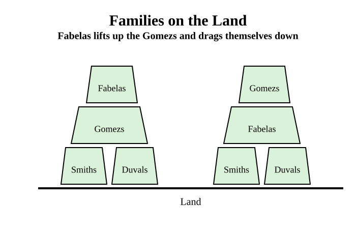
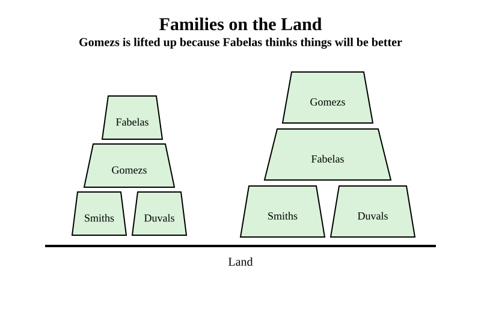
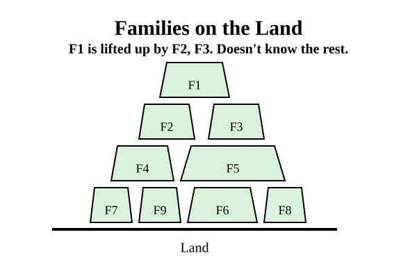

# Kegology Political Theory

**Date:** 2026-06-28  
**Author:** Emmanuel Schalk  
**Description:** A generalized theory of political mechanics

*I'm letting go of what I can't be anymore*

---
<!--Home: -->
Being a philosopher is great. Even if you have a very small audience of just your friends being a philosopher means, amoung other things, you're constantly interested in new things and figuring out how they work. You learn things and make theories from them. Of course the place to get the best new things are other thinkers. My favorite popular thinker is Kamil Kazani. <!--Need: -->

BUT in his latest article [How to study politics](../ch40_pop_phil/kazani_how_to_study_politics.md) he writes that most historians can't generalise the interesting facts they know into a good political theory. Most books authored by historians have dull and stupid theory even though they want to be insightful. Why, because...

> ...historians fail to deliver, because they (most of them) are simply not brilliant enough.

Ouch! My dad was a historian. A pretty good one[^1]. Wrote a book and everything. 

Kazani says my dad and his ilk can't theorize well. He using entertaining and hard words. Some very harsh. Hard to be entertaining and not harsh, it's what [second hand dealers](../ch40_pop_phil/kazani_kill_the_scholars.md) do. I shouldn't take it so personally. And yet I feel something very primal... 

### Family Honor!

<!--Go: -->
My copy of *From Valor to Pedigree* is far away so I'll present the political theory of [Kegology](../ch41_wheel/schalk_kegology_name_origin.md). My Dad was a better scholar than me so if I can create a political theory that is awesome then he would have had one that was even better.  

<!--Search: TODO. -->
## Kegology Political Theory

Here's a footnote describing the philosophical foundations of Kegology[^2]. Read it if you want. The gist is Levinas (died 1995) had an awesome philosophy of the Face built from biblical traditions.

The most important question in Kegology is "am i a good father?" Even if you are a woman and have given birth to children the question is still "Am I a good a Father?" The concept of Fatherhood holds contradictions: Fatherhood is and isn't about genetics. Until recently loving your children because of genetics was obvious for a Mother but required faith from the Father. 

For any Levanisian, for any Kegologist the first question is "am i a good father?" And where do we go to find out? The Face of the Other. The Face of my son. 

Notice that for this graphic the son's Face is in the shape of an infinity symbol ala &infin;. That's because in Levanis's Ethics the Face of the Other is infinite. There is no way to understand it, yet we try and that attempt turns into truth. 

#### For Levainas and me the Face being the source of all truth  isn't something that should be, **it's something that is**.

 

The Face of the Other tells me it's suffering and I interpret what their needs are. I'm a good father if I take care of their needs. 

Naturally there are other Faces...

To be good to my son I need to also be good to people he takes care of. Since each Face is infinite it's a lot of infinities. The infinities are different, disjoint.

Here's the thing: You can only listen to one Face at a time. Everyone, anyone, that was previously listened to is no longer an infinite. Their suffering has been interpreted in a set of needs. Needs at are known, complete, the word used by Levinas is "totalizied". Here you see one infinite Face and three understood people. 

Notice that all needs are created in the past so it's possible to both have the past needs of the son and be engaged to the Face of the son. In the graphic below you'll see that the "son's needs" block and the Face infinity both exist at the same time. 

Listening to the Face is exhausting and anxiety inducing. Most of the time we're just with the needs that we've understood from the past. Confidence is required to make decisions and speak. The anxiety of listening is incompatible. So by definition when Being in the world is a Faceless experience. All we have is our knowledge of the needs of others from past encounters with the Face. 

If I am good to the needs of all the contacts below I'm a good father. 

Not so fast, what about others outside the family we encounter? Am I to be good to all their needs too? Its too much. If everyone is Family no one is Family. 

In the graphic below you'll see I've bubbled in all the contacts needs that are in my Family.

So by this grouping there are two kinds of needs to be considered when answering the question *am i a good father?*

*Did I take care of my Family's needs? Or everyone else's?*

## What about my Boss?

A understandable retort could be that for many people today, especially educated people, most of what they do is for their boss. How can I be a good father if I mostly do stuff for my bosses and my bosses are not Family? The answer that is in a low-trust society we only work for our bosses insofar as it helps our family. Let's break this down...

#### Boss/family reasons for doing anything

| Reason                                         | Worker Kind    |
|------------------------------------------------|----------------|
| Helps **family** and helps **boss**            | motivated worker |
| Helps **family** and does not help **boss**    | family helper    |
| Does not help **family** and helps **boss**    | honest worker    |
| Does not help **family** and does not help **boss** | charity worker |

Most people are not honest workers. If the boss tells them to do something that hurts their family they'll do everything they can not to do it. If the boss has lots of control then the worker is still not an "honest worker", they're just doing what is least painful for their family. 

Question: Why I do stuff? 
Answer: Me -> helps family -> Family

And what is Family?

All humans deal with this question. Ask anyone what they think. Here's what I've picked up.

- Pretty much everything I do is for family. 
- My family has changed over time.
- There are lots of reasons families change.
- Anyone can become a member of a Family.
- Most of the time Family members are dedicated to the same Family, i.e. you know when someone is not Family.

Ok, we now know Families exist and where they come from: Individuals having decided what their family is and then helping it. Great. Now where does power come from? How do some Families become powerful and most never move up?

#### Power comes Families and starts in the Land

In a low trust society model power purely from FamilyUnits and Land.

   

   

   

   

   

   

   

   

   

   

   

### Oligarchy

First let's establish Kazani's favorite political axiom: All governments are oligarchies. Kazani references a Historian that is brilliant.

> Ronald Syne wrote ""In all ages, whatever the form and name of government, be it monarchy, republic, or democracy, an oligarchy lurks behind the façade."[^3]

Ok but what are oligarchies made of? It can't just be the individuals that's too limited. It can't just be coalitions that believe in the same concepts. That's not limited enough. What about family? Kazani writes how family is the basic socialogical unit in [The Able Family](../ch40_pop_phil/kazani_the_able_family.md). And I'm not original at all with this. I grew up with lots of Mexicans and they always say 10 families control Mexico. So there we go:

### Every Oligarchy are made of Families

 The oligarchy can be best understand as a bunch of Families. A Family can have a dominate personality as letter but is better to think of families rather then personalities[^4] because the trusted family members of a leader can often have enourmous influence. Kamil Kazani claims that one of the people in the Yelstin family portrait above made Vladamir Putin king. It wasn't Boris Yelstin. Do you know which one it was? Do you know his name? I don't. Still I know the Family: The Yelstin Family. A Family that had **prestige** but then it fell from power.

#### "...Status & prestige is a zero sum game..." Kamil Kazani on Twitter[^5]

Let's define the term *'prestige'* the way Kazani and others do. A Family with Prestige has status, influence, power. It is something a family either has or doesn't. It cannot be shared. 

The Families in power have all the prestige. If they cooperate no other families will ever have prestige. The coalition will rule forever. However (most of the time) these families do not trust each other and are often in conflict. The conflict can be reasonable or unreasonable. Petty jealously, revenge or lust can motivate a conflict. To gain an upperhand a family can decide to get help from others outside of power. The non-prestigious family provides a service and the prestigious family invites the non-prestigious family into power. 

#### An 'invitation' is the act of giving prestige to a family that has none.

Logically this invitation should only be extended when the prestigious family has no other choice. When they feel they are in danger of losing prestige. Expanding how many families have prestige is dangerous. The fewer players in the game the easier it is to stay in the game. Let's visualize these dynamics with some diagrams:

### The Wheel

Any system of centralized power can be represented as a Wheel. A wheel that turns. Families go up in prestige, families go down in prestige. New famlies can enter power and gain maximum prestige and old families can exit power and lose all prestige. Most of the time the oligarchy is remarkable stable. The advantages of prestige are considerable. There is the endless multitude without prestige who will do absolutely any service for a chance of getting prestige[6]. And promises don't even have to be made, the implication is obvious.

As the Wheel spins there are families that are winning and families that are losing. On the other hand some families lose so much they fall out of power. There is also the "stable" section of the Wheel where families have prestige but their influence does not increase or decrease.  

Why do Families fall? Perhaps the most important member dies or becomes unpopular. There are many reasons why it can happen, in [The Poverty of Realism](../ch40_pop_phil/kazani_the_poverty_of_realism.md) Kazani lays out how the powerful stop from falling. Here are the rules edited to explicitly refer to families. 

> 1. No family becomes powerful by accident
> 
> 2. To become powerful, a family must first win the power
> 
> 3. And then the family must defend it from all kinds of the pretenders 
> 
> 4. Defending the power takes at the very, very least 99% of the family's attention
>  
> 5. If the family cannot fulfil this bare minimum, it will be ousted out by a more single-focused family

Families only invite a Family out of power into power when they can provide a service. Something useful to them. That is represented here as a ladder. The family out of power must have a large ladder to even be considered for invitiation[^6]. The obvious example is money. Money is not equal to prestige. But if someone in power wants money then a ladder made of money can result in an invitation.

Here's a diagram showing what the Wheel could look like with distinct families in power, falling out of power, and totally outside of power.

Here's what it looks like when a Wheel touches another Wheel. Each system of power requires institutions, customs, language so precise to their circumstances that they can only be described as "alien" by a different Wheel. 

Let's introduce a few terms here. For every Wheel we can describe

1. Wheel Size: The radius of the Wheel. Represents how powerful the wheel is.
2. Stable Size: The radius of the stable part of the Wheel. Represents how powerful the stable part of the wheel is.
3. Moving Size: The width of the moving part of the Wheel. Represents how powerful the moving part of the wheel is. (Moving_Size = Wheel_Size - Stable_Size)

Between two Wheels that touch they can create a border. All systems of power want to have a border to define the alien and the non-alien.

Here's a scenario where many wheels of different color exist in touch. (Please excuse the circles that don't actually touch others, if they're really close they're meeant to touch.)

Here's the same scenario with many borders. Notice the space between borders. That's a feature that is important, because borders can become their own space that's weirdly part of both wheels and not.[^7] Wheels exist against each other. 

Going back to the Wheel: as the wheel turns there are winners and losers and the stable. The winners are climbing and the losers are clinging. What are they climbing and clinging to? Two things: each other and vassalage networks. 

- Winning families are climbing on top of the stable families and losing families. Stable ones can take it. Losing ones can't. Climbing on top of losing families isn't very effective. Because they're going down. Climbing on stable ones is effective.
- Losing families are clinging to stable families and winning families. 

### How to get The Welcome.

A family with prestige will only consider inviting another family into power if they have a "load-bearing" ladder. Something the prestigious family can climb. The welcoming family is climbing on top of the invited family and invited family is clinging to the welcoming family. Naturally this means that if you're trying to climb from out of power into power you can't go any higher then the welcoming family.  

And it don't matter how load-bearing your ladder is, there's no guarentee of an invitation. 

# TODO change ladder to pillar, pillars sometimes have a ladder on the side

<!--Find: -->
## The Wheel is Good Theory

Obviously this isn't perfect but it's good theory. 

<!--Take: Now I can never be a historian. The process of making this Theory has made me into an ideaologue. I'll never be able to be like my Dad. I will always see the world through Kegology, thats how I've trained myself. My dad was trained as a historian. He was trained to view the world with the least possible of idealogy possible.-->

These are the mechanics of the the KegWheel. Next part will address what it's good for. 

---

## Footnotes

[^1]: [Historian Ellery Schalk Obituary](../ch40_pop_phil/hacket_ellery_schalk_obit.md)

[^2]: Reality is infinitely complex. Any model of reality will be wrong. But some models are better than others. KegWheel Theory is a model of understanding power and predicting how to affect change. 

The easiest introduction to the concepts of KegWheel is from the writings of Kamil Kazani. The quickest primer is Kazani's article on the [Mechanics of Revolution](../ch40_pop_phil/kazani_mechanics_of_revolution.md). 

Fundamentally KegWheel is not motivated by Kazani's cynical worldview but by Emmanuel Levinas's MetaEthics. The source of all truth is the Face of the Other in front of me. It can get pretty complicated so leave it for later. I just wanted to declare this. It is important to me.

[^3]: Ronald Syne (died 1989), Historian and Author of Books on Roman History. 

[^4]: Basically all leaders have family they trust. To understand how someone of prestige got that prestige see Kazani in [The Able Family](../ch40_pop_phil/kazani_the_able_family.md) 

[^5]: Taken from conversation about Ukraine [Kazani Twitter Posts](../ch40_pop_phil/kazani_twitter.md)

[^6]: [The Vassal Strategy](../ch40_pop_phil/skallas_the_vassal_strategy.md)  

[^7]: I grew up on a border so I have strong opinions about these things. 

## Biblography

#### Easy reads:

How power is structured: [Mechanics of Revolution](../ch40_pop_phil/kazani_mechanics_of_revolution.md)  
The real work of leadership: [How Stalin Came to Power](../ch40_pop_phil/kazani_how_stalin_came_to_power.md)  
How slavish devotion is perfectly reasonable1: [Suffering from Success](../ch40_pop_phil/kazani_suffering_from_success.md)  
How slavish devotion is perfectly reasonable2: [The Vassal Strategy](../ch40_pop_phil/skallas_the_vassal_strategy.md)  
How a history of Rome best teaches how politics works: [How to study politics](../ch40_pop_phil/kazani_how_to_study_politics.md)  
Why Plato's power behind the throne plan fails: [Wisdom of Lenin](../ch40_pop_phil/kazani_wisdom_of_lenin.md)  
Why and how thinkers matter: [Kill the Scholars](../ch40_pop_phil/kazani_kill_the_scholars.md)  
Why domestic goals motivate the most: [The Poverty of Realism](../ch40_pop_phil/kazani_the_poverty_of_realism.md)  
How tyranny protects power: [Why Putin killed Navalny](../ch40_pop_phil/kazani_putin_navalny.md)  
Levinas and the Face intro: [I exist, I suffer. Please don't destroy me.](../ch40_pop_phil/thompson_i_exist_i_suffer.md).  

#### Foundational Texts:

Totality and Infinity (1969) by Emmanuel Levinas  
Levinas's writings on Time as explained by second-hand dealer of ideas Partially Examined Life [Episode 146: Emmanuel Levinas on Overcoming Solitude](https://partiallyexaminedlife.com/2016/09/05/ep146-1-levinas/)  
Lecture printouts and notes from 2012 Levinas class taught at UTEP by Jules Simon

#### Philosophical Father
Dr. Jules Simon, Professor of Philosophy at University of Texas at El Paso, retired.   
(I haven't had a chance to show him Kegology, hopefully he can make some time for me.)

#### Keywords List
alien
bearing
Climb
climb
cling
Losing
losing
kneeler
loser
Pay
pay
Prestige
prestige
Stable
stable
valor
Welcome
welcome
wheelers

######
Home: Where I'm comfortable beling a philosopher-without and audience. Just playing with my toys.

Need: Kamil Kazani declares historians bad at Theory. They are terrible at it. I need to defend family honor. 

<!--Return: I'm going to be a philosopher. I am publishing this Theory. I accept that I'm an ideaologue.-->

<!--Change: I'm now aware of the places I can never go. Yet, maybe if I drink...-->
######
- Take: There is now a distance between my dad and me. He didn't develop a generalized theory so that he could really listen, not fit everything into his categories. I will never get rid of Kegology, it's how I think now.
- Return: I remember the things that he really cared about. The people in his life. I can do that.
- Change: Now I have a cool theory and answers to the question "what do I do next" And I know what to do with my fear. I just remember my Dad's bravery.
